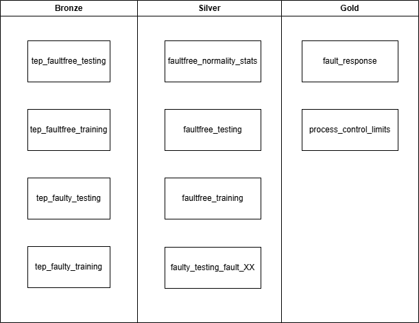

# Project Name
Pharma-Lakehouse-Portfolio

# Description
Repo to learn and play around with databricks. I used the TEP [dataset](docs/dataset.md) as an example.

# Structure

## Overview
Raw process production data lands on the bronze layer where is gets processed into the silver layer. Insights are shown on the gold layer.

## The business questions
- How does each fault affect each variable?
- What are the expected operating ranges and where should alerts trigger?

## Arquitecture diagram

 

## Stack
- Databricks
- Delta lake
- PySpark
- Unity catalog
- SQL

## What's in each folder
/notebooks    — your Databricks notebooks (exported)  
/data         — raw sample data + README explaining sources  
/docs         — architecture, dataset rationale, decisions log  
/sql          — any standalone SQL  
README.md     — hiring-manager-facing summary  

## What I'd add for production

-**CI/CD and environment promotion** — the project runs from notebooks in a single workspace. Production needs dev → staging → prod separation with Databricks Asset Bundles, automated deployment on merge, and no manual runs. Everything I deployed here, a human clicked.

-**Data quality contracts** — Auto Loader + Delta handles schema enforcement, but there's no explicit expectation layer. In production you'd want DLT expectations (or Great Expectations) with a quarantine table for bad records, not just silent schema evolution or job failure.

-**Secrets management** — config values are in the notebook or cluster env vars. A real setup uses Databricks Secrets backed by Azure Key Vault / AWS Secrets Manager, scoped per environment.

-**Observability and alerting** — Lakeflow job failure triggers a retry, and that's it. Missing: row count anomaly detection, data freshness SLAs, integration with an alerting channel (PagerDuty, email, Teams). You'd want to know if the pipeline ran but delivered 0 rows.

-**Dead-letter / quarantine layer** — records that fail Silver transformation currently cause the job to fail or get silently dropped. Production needs a bad-records table with enough metadata to debug and reprocess.

-**Testing** — no unit tests for transformation logic. You'd want pytest + pyspark (or nutter) testing the Silver transformations against known inputs, ideally running in CI before any deploy.

-**Scale assumptions** — the TEP dataset is small. At real scale you'd revisit partitioning strategy, add Z-ordering or liquid clustering on the Gold tables, and set a VACUUM/OPTIMIZE schedule. None of that is needed here but it's invisible until it isn't.

-**Cost governance** — clusters are sized for a portfolio. Production needs tagging for cost attribution, right-sizing per workload, and a Photon decision for the compute-heavy paths.

## License
GNU GENERAL PUBLIC LICENSE Version 3