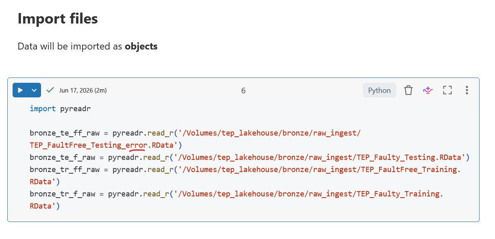
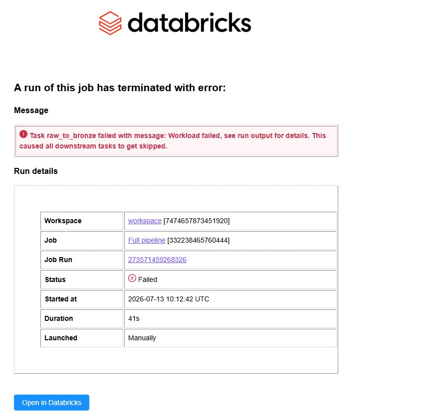
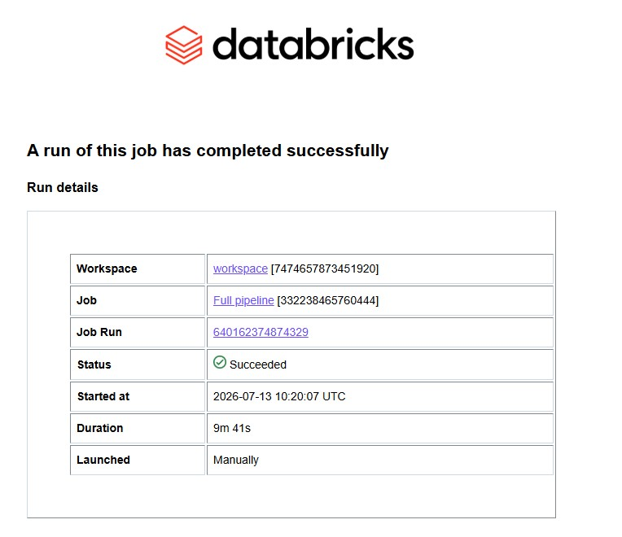

# Decisions made

## Lakeflow jobs
- Lakeflow Jobs was chosen over ad-hoc notebook execution to provide dependency-aware task sequencing, per-task cluster lifecycle management, and a reproducible run graph that reflects how this pipeline would behave in a regulated production environment.
- Deliberate failure injection at the Bronze task confirmed that downstream Silver tasks are correctly skipped, but that failures are silent outside the Databricks UI by default — making explicit email or webhook alerting a hard requirement before any production promotion.

- For a production deployment, the minimum additions would be: per-task failure notifications, a data quality gate between Bronze and Silver using Delta constraints or a lightweight expectation suite, and parameterised cluster configs to separate dev and prod compute costs.